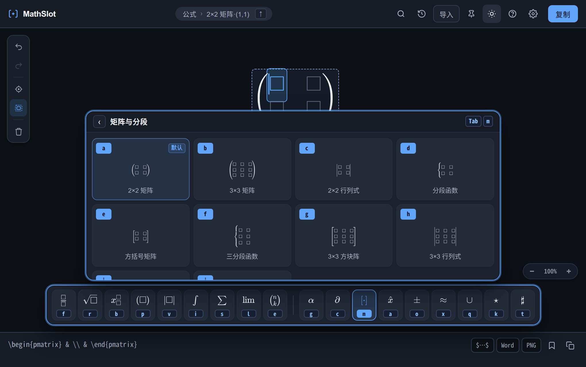
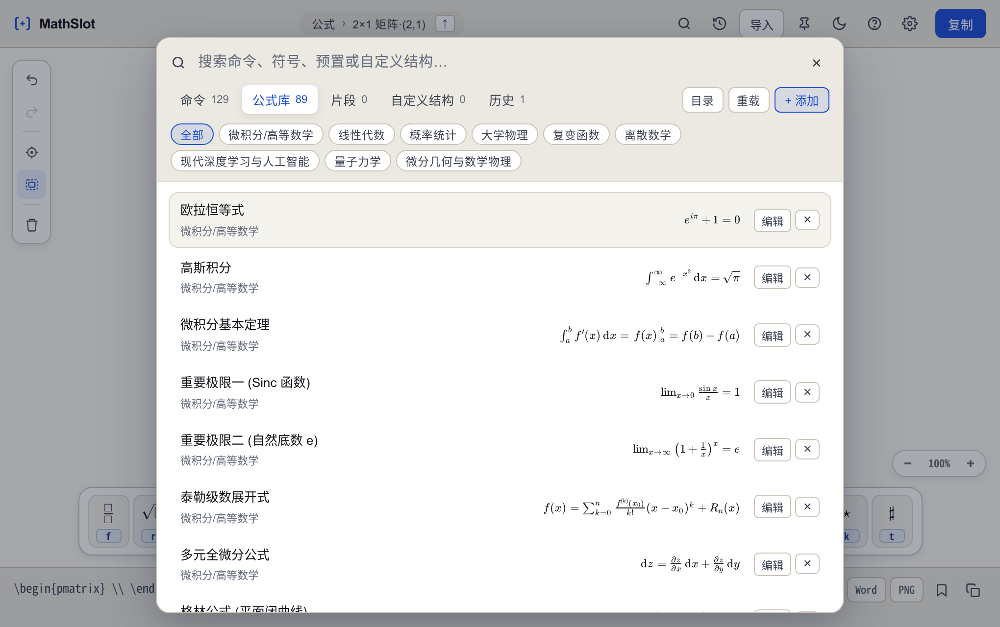

# MathSlot v3.1.0-beta.5

**视觉直觉优先、键盘流全控、出版级 LaTeX 排版的数学公式工作台。**  
桌面端（原生 Tauri 2，提供 Linux `.rpm`/`.deb`/`.AppImage`、Windows `.exe`/`.msi`、macOS `.dmg`）与 Obsidian 插件（零 WASM，纯 JS/CSS）双端同源。

- 🚀 **[5 分钟快速开始（QUICKSTART.md）](docs/QUICKSTART.md)** — 从安装到亲手打出傅里叶级数、范德蒙德行列式
- 📖 **[详细使用手册与键位速查（GUIDE.md）](docs/GUIDE.md)** — 完整快捷键、智能缺省、LaTeX 兼容、外部 `presets.json` / `commands.json` 配置
- 🔍 **[全栈源码深度审计（AUDIT.md）](docs/AUDIT.md)** — 零文档假设源码实测基线、安全边界评估与存量技术债剖析
- 🗺️ **[产品与架构路线图（ROADMAP.md）](docs/ROADMAP.md)** — `v2.3.x → v3.0` 四阶段演进蓝图与问题闭环追踪矩阵

---

## 界面预览

### 亮色主工作台（范德蒙德行列式 + 层级虚线框 + 左侧悬浮编辑栏 + 多行 LaTeX 栏）


### 暗色模式 & 二级菜单即时默认与无缝变形（`Tab m`）


### 命令与 114+ 预置公式库（`Ctrl+K`，支持外部 JSON 热重载）


---

## 核心特性

- **2D 实时所见即所得 + 层级虚线框**：直接基于 KaTeX 2D 画布编辑，清晰展示嵌套结构边界，支持点击/拖拽/双击选中、画布缩放（`Ctrl+滚轮`）与长公式横向滚动。
- **左侧悬浮编辑栏 + 多行自适应 LaTeX 源码栏**：撤销/重做、分层跳转、层级框开关、清空画布纵向悬浮在画布左上角；底部 LaTeX 源码栏支持自动换行、随长公式自适应增高、展开收起与 `Shift+Enter` 换行编辑。
- **智能缺省与复用**：
  - `Tab r` 统一二次根号与 N 次根号（根指数留空自动按 `\sqrt{x}` 渲染，填写或按 `↑` 补填即成 `\sqrt[n]{x}`）。
  - `Tab i` 积分、`Tab s` 求和、`Tab b` 上下标等均支持可选槽位自动省略，跳过上下限直接得不定积分 `\int f(x)\,\mathrm{d}x`、单下限求和 `\sum_{i\in S} a_i`。
- **二级菜单单字母即时默认 + 无缝变形**：按 `Tab m` 立即在画布渲染默认 `2×2 矩阵`，直接打 `1 Enter 2…` 自动透传输入；若紧接着按第二键（如 `d` 分段函数、`j` 省略行列式），原地无缝替换。
- **LaTeX 原生命令兼容**：支持直接输入 `\int_`、`\int `、`\frac{`、`\sqrt[`、`\sum_`、`\alpha_1`、`\vdots `、`\pmatrix ` 等标准 LaTeX 命令并实时转为 2D 交互结构。
- **自然输入 & 零误伤简写**：
  - 直接键入 `/` 转分数、`^` / `_` 转上下标、`()` / `[]` / `{}` 自动补全且随高度自适应 `\left...\right`。
  - 独立词识别 `pi → π`、`oo → ∞`、`dx/da/dA → 直立微分`（如 `\,\mathrm{d}x`；`d x` 保留字面量 d 与 x）、`... → ⋯`、`::: → ⋮`、`ddots → ⋱`，绝不误伤 `spin`、`spi`、`foo` 等普通单词。
- **动态矩阵、增广矩阵 & 键盘全向增删行列**：支持任意 R×C 矩阵、`array {cc|c}` 增广矩阵、`smallmatrix` 及 `cases` / `dcases` / `rcases` 分段函数；内部按 **`Shift + ↑ / ↓ / ← / →`** 四方向增行列，点击悬浮条 **`|线`**（或按 `Alt + \`）一键切换增广矩阵分隔竖线；内置 `Tab m i` 省略矩阵、`Tab m j` 省略行列式、`Tab m k` 增广矩阵。
- **富文本内嵌数学、字体算子与 `\\` 原生透传槽**：`\text{...}` 文本注释内部按 `$` 可直接嵌入可交互数学槽位（如 `\text{当 $x > 0$ 时}`）；任意槽位连敲两次反斜杠 `\\` 即开原生 LaTeX 透传胶囊（内部语法糖静默、编辑态防崩隔离、跳出后自动安全渲染 2D 公式）；内置 `\mathbf`、`\mathcal`、`\mathbb`、`\mathrm`、`\mathfrak`、`\mathsf`、`\mathtt`、`\boldsymbol`、`\mathscr`、`\operatorname`、`\bigoplus`、`\bigotimes`、`\bigwedge`、`\ket`、`\bra`、`\braket`、`\xRightarrow`、`\xLeftrightarrow`、`\xmapsto`、`\stackrel`、`\tag`、多列 `aligned` 及完整否定关系与逻辑推导等 **229 条**结构化命令与 **114 条**预置公式。
- **跨槽选区、矩阵子块与表格粘贴**：支持跨槽拖选 / `Shift+方向键` 自动向上晋升包裹外层结构、矩阵矩形子块选区复制与清除，以及直接粘贴 TSV/Excel 表格数据自动扩阵填充。
- **结构化草稿、收藏夹 & 无障碍触控**：`PersistedDraftV1` 完整保留光标与空可选槽并在关闭窗口前同步刷盘；Pointer Events 统一鼠标/触控笔/触屏交互，支持 `Ctrl+M` / `F6` 键盘焦点逃逸。
- **分层 `Esc` 跳转导航**：按 `Esc` 呼出当前层级的字母角标（支持复合结构逐层下钻、普通文本项直接跳转、以及 `Alt+←`/`Alt+→` 跳转历史回溯）。
- **开放外部公式库 & 命令库**：支持软件内直接增改删，也支持直接编辑配置目录中的 `presets.json` 与 `commands.json` 并一键热重载，无需改代码或重新编译。
- **Obsidian CM6 原生底部停靠工作栏 + 全屏弹窗双模同源**：通过 CodeMirror 6 官方 `showPanel` 将 2D 画布与命令丝带无缝停靠在笔记窗格底部，按 `Alt+M` 一键进入（或光标点入任意 `$...$`/`$$...$$` 即刻随文档同步预览），绝不遮挡正文上下文；按 `Tab w` 可打开完整弹窗工作台（含 Callout 引用块保真读写与 MathML/PNG 导出）。
- **多格式一键导出**：纯 LaTeX / `$…$` / `$$…$$` / ` ```latex `、**Word 公式（MathML）**、**3× 高清 PNG 图片**，以及多行推导自动对齐 `\begin{aligned}`。

---

## 安装与使用

### 1. 桌面端安装包（GitHub Releases 自动构建）

前往 **[GitHub Releases](../../releases)** 下载对应平台的安装包：
- **Linux**：`.rpm`（Fedora / RHEL）、`.deb`（Ubuntu / Debian）、`.AppImage`（通用便携版）
- **Windows**：`.exe`（NSIS 安装包） / `.msi`
- **macOS (Apple Silicon)**：`.dmg`

例如 Fedora 下本地安装 RPM：
```bash
sudo dnf install ./MathSlot-3.0.0-1.x86_64.rpm
```

### 2. Obsidian 插件（零 WASM）

从 Releases 下载 `mathslot-obsidian-3.0.0.zip`（或将 `apps/obsidian/dist/` 内的 `main.js`、`styles.css`、`manifest.json` 三个文件）解压到你的仓库插件目录：

```text
<你的 Obsidian 仓库>/.obsidian/plugins/obsidian-mathslot/
```

在 Obsidian「设置 → 第三方插件」中启用 **MathSlot** 即可。

### 3. 从源码开发与构建

```bash
# 安装依赖
npm install

# 运行全部核心单测（含全量命令与预置公式 KaTeX 渲染验证）及类型检查
npm run test
npm run check --workspace=@mathslot/obsidian

# 开发模式启动桌面前端
npm run dev

# 构建桌面前端 + Obsidian 插件（产物位于 apps/obsidian/dist/）
npm run build

# 打包 Fedora RPM 安装包
npm run build:rpm
```

---

## 仓库结构

- `packages/core` — 纯 TypeScript 同步内核（树状槽位 AST、统一 `EmitIR` 词法与间距管线、单源声明式蓝图 `commandSpecs.ts`、双向流编码器 `streamCodec.ts`、229 条命令、114 条预置公式、跨槽 LCA 选区与矩阵块操作、LaTeX 双向解析与多行 `aligned` 导出、Obsidian `\(...\)`/`\[...\]`/引用块保真识别）
- `packages/ui` — 共享 Svelte 5 + KaTeX 2D 公式工作台（Pointer Events 画布、左侧悬浮编辑栏、层级虚线框、快捷丝带、命令与公式库搜索面板、多行 LaTeX 栏、支持 CSS `transform` 的矢量 SVG / 高清 PNG / Word MathML 导出）
- `apps/desktop` — Tauri 2 桌面端外壳（零 JSON 二进制 IPC 剪贴板/导出、Linux Wayland 图标集成、原子配置文件读写、跨平台打包）
- `apps/obsidian` — Obsidian 纯 JS 插件（零 WASM、CM6 原生 `showPanel` 底部停靠工作栏与文档双向实时同步、`Tab w` 切换全屏弹窗工作台、`\(...\)`/`\[...\]` 原样写回与引用块/Callout 替换）
- `apps/web` — 零安装离线 PWA 在线工作台（共享同源 `@mathslot/core` 与 `@mathslot/ui`）
- `docs/` — [快速开始](docs/QUICKSTART.md)、[详细帮助手册](docs/GUIDE.md)、[源码深度审计](docs/AUDIT.md)、[演进路线图](docs/ROADMAP.md) 与 [界面截图](docs/images/)
